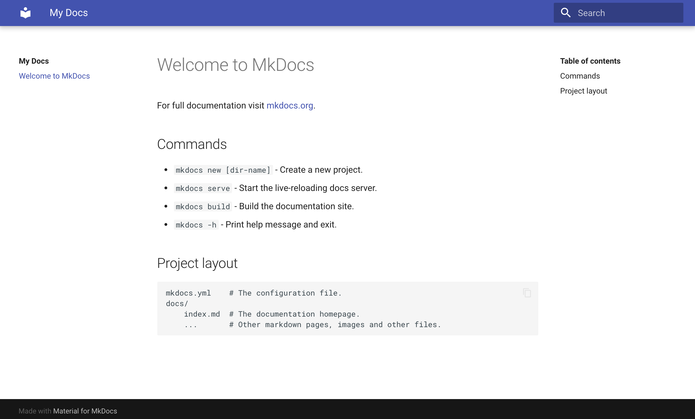
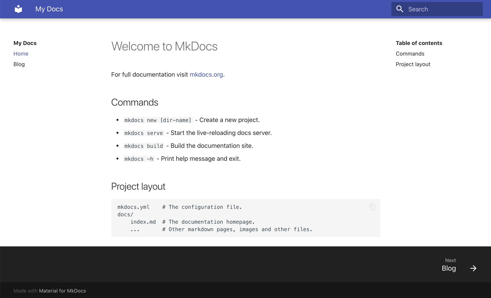
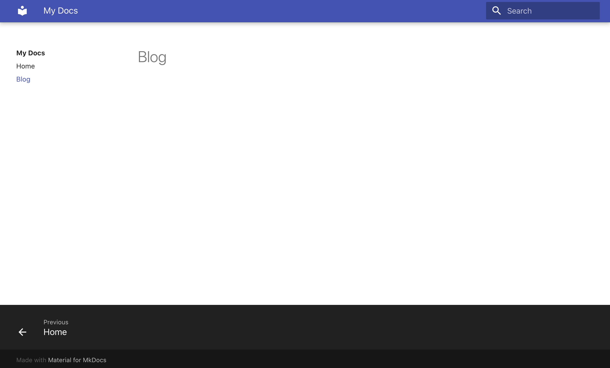
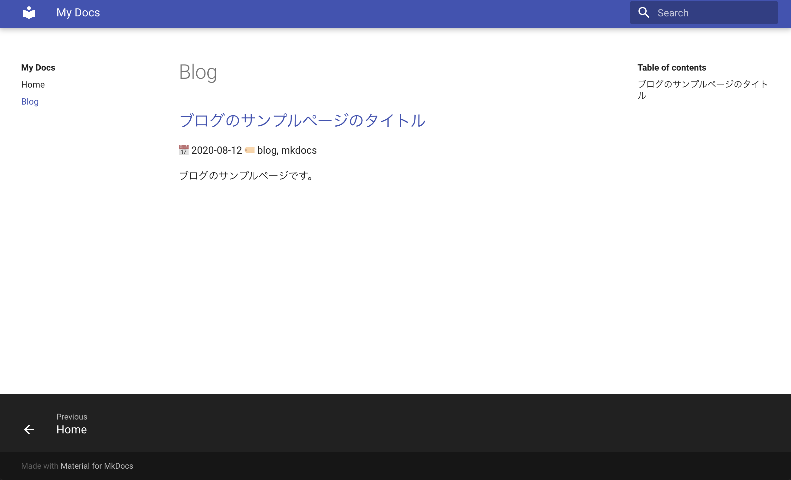
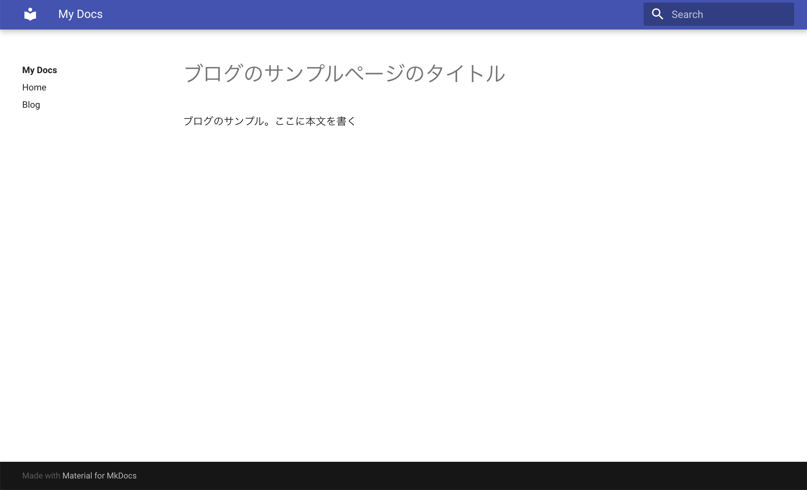
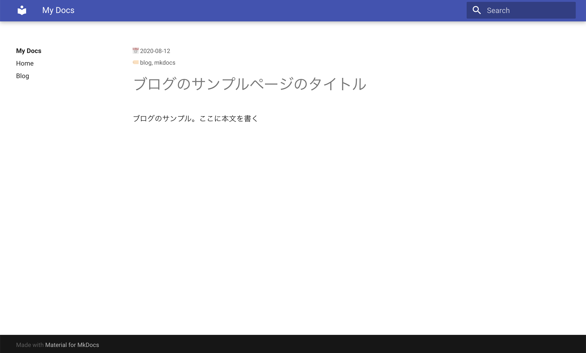

# MkDocsでブログを書く

今までブログはMarkdownで書き、GitHub Pagesがデフォルトで提供しているテーマ+カスタムCSSという設定で運用していました。
この方法では、記事をMarkdownで作成しGitHubプッシュすれば、あとはGitHubが自動でHTMLにビルドして `https://<username>.github.io` というドメインにページを公開してくれ、大変便利でした。

一方で、ソフトウェアのドキュメントは普段から [MkDocs](https://www.mkdocs.org/) を使って書いており、シンプルな設定でスタティックのサイトを構成できるのでとても重宝しています。

そこで今回、使い慣れた MkDocs でブログも書けないものかと設定を考えてみました。
MkDocsには標準ではブログの機能は入っていないため、必要なものは自分で実装する必要があります。

!!! note
    MkDocsには [プラグイン](https://github.com/mkdocs/mkdocs/wiki/MkDocs-Plugins) があり、その中にはブログ用のものもあるようです。

ブログ用といっても自分には多くの機能は必要ないため、最低限の次の機能を入れる方法を検討しました。

- 記事一覧
- 日付、タグ、ブログの概要等のメタデータ

そこで今回、MkDocsとそのテーマの一つである material を使って、MkDocsをブログ用にカスタムする方法を考えてみました。

## 結局、何ができるようになるのか

ブログ記事となる Markdown の冒頭に日付、タグ、詳細といったメタデータを付与することで、
それにしたがって

- 記事一覧ページの作成
- 各記事に日付、タグの表示

ができるようになります。

## ディレクトリ構成

今回は次のように大きく二つのディレクトリからなる構成にします。

```
.
├── docs (ビルド済みのスタティックファイルをおくディレクトリ) 
└── src  (MkDocsの設定ファイルとMarkdownファイルをおくディレクトリ)
```

`src` ディレクトリ以下にMkDocsの設定ファイル `mkdocs.yml` およびMarkdownのドキュメントを置きます。

そして、 `docs` ディレクトリ以下にはビルドしたHTMLファイルを置きます。
GitHub Pagesでは公開するディレクトリの設定として

- プロジェクトの `master` ブランチのルートディレクトリ以下
- プロジェクトの `master` ブランチの `docs` ディレクトリ以下
- `gh-pages` ブランチのルートディレクトリ以下

の3種類を提供しています。
今回のように、設定ファイルとHTMLファイルを一つのプロジェクトの同じブランチ以下で管理する場合は2番目の方法をとります。
HTMLドキュメントを GitHub Pagers で公開するときにどの戦略を取るのがよいかは [CircleCI のブログ](https://circleci.com/blog/deploying-documentation-to-github-pages-with-continuous-integration/) が大変参考になりました。

それでは設定していきます。

## インストール

設定に先立って、今回作業するコンテナを起動します。

```sh
$ docker container run -w /work -v $(pwd):/work --rm -it -p8000:8000 python:3.8.2-buster bash
```

必要なパッケージをインストールします。

```sh
(docker container)$ pip install mkdocs==1.1.2 mkdocs-material==5.5.12 fire==0.3.1
(docker container)$ apt update && apt install tree
```

## MkDocs の初期設定

`mkdocs new` コマンドで MkDocs の初期設定ファイルを `src` ディレクトリ以下に生成します。

```sh
(docker container)$ mkdocs new src
INFO    -  Creating project directory: src
INFO    -  Writing config file: src/mkdocs.yml
INFO    -  Writing initial docs: src/docs/index.md
```

これで初期設定ファイルとMarkdownファイルが生成されます。

```sh
(docker container)$ tree .
.
└── src
    ├── docs
    │   └── index.md
    └── mkdocs.yml

2 directories, 2 files
```

MkDocsでは `mkdocs serve` コマンドでローカルサーバを立ち上げる機能があり、作成したドキュメントをブラウザから確認することができます。
それではコマンドを実行してみましょう。


```sh
(docker container)$ mkdocs serve --config-file src/mkdocs.yml --dev-addr 0.0.0.0:8000
```

http://localhost:8000 にブラウザからアクセスすると `src/docs/index.md` に書かれた内容が表示されます。
確認できたら一度 `C-c` でサーバを終了させておきましょう。

### スタティックファイルのビルド

ローカルサーバでドキュメントを確認できたら、スタティックなHTMLファイルを生成してみましょう。

```sh
(docker container)$ cd src
(docker container)$ mkdocs build --site-dir ../docs
INFO    -  Cleaning site directory
INFO    -  Building documentation to directory: /work/docs
INFO    -  Documentation built in 0.75 seconds
(docker container)$ cd ..
```

はじめに説明したディレクトリ構成にしたがって、HTMLファイルの生成場所を `--site-dir` オプションで `src` ディレクトリからの相対パス `../docs` ディレクトリに設定しています。
これで、 `docs` 以下にHTMLファイルが生成できます。

あとは GitHub にプッシュして GitHub Pagers の設定をすれば公開完了です。(今回はGitHubにプッシュする以降のステップは省略します。)

ここまでで次のようなディレクトリ構成になりました。

```sh
(docker container)$ tree -L 2
.
├── docs
│   ├── 404.html
│   ├── css
│   ├── fonts
│   ├── img
│   ├── index.html
│   ├── js
│   ├── search
│   ├── sitemap.xml
│   └── sitemap.xml.gz
└── src
    ├── docs
    └── mkdocs.yml

8 directories, 5 files
```

## テーマの設定

それでは、MkDocsにmaterialの設定をしてみましょう。
次のように `src/mkdocs.yml` の `theme` パラメータ以下で `material` を指定します。

```sh
site_name: My Docs

theme:
    name: material
```

再びサーバを起動して確認すると、material のテーマになっていることがわかります。



## 記事の作成

テーマの設定まで完了しましたので、次はサンプルとなるブログ記事を作成してみましょう。

今回は `src/docs/blog` というディレクトリを作成してその下にブログ記事を置くことにします。

```sh
(docker container)$ mkdir src/docs/blog
(docker container)$ touch src/docs/blog/20200812-article.md
```

テスト用にブログ記事を適当に書いておきましょう。

```markdown
---
date: 2020-08-12
tag: blog, mkdocs
description: ブログのサンプルページです。
---

## ブログのサンプルページのタイトル

ブログのサンプル。ここに本文を書く
```

ポイントは、Markdownの先頭に `---` で挟むことでメタデータを付与することです。
このメタデータが今回のブログ化で最も重要な点になります。
メタデータは MkDocs 内でページを生成する際に使うことができる他、
後ほどスクリプトで解析して記事一覧ページを自動作成するのにも利用します。

## ブログ記事の一覧ページを作成する

ブログ記事は一覧ページで確認できるのが望ましいですので、一覧ページを作成してみましょう。

そこでまず、 `src/docs/blog.md` というブログ一覧ページ用のファイルを作成します。

```sh
(docker container)$ touch src/docs/blog.md
```

このファイルの内容は後からスクリプトで自動生成することにしますので、
ひとまず空ファイルのまま進めましょう。

次に `src/mkdocs.yml` で `nav` の設定を行い、一覧ページを表示するように設定します。

```yaml
site_name: My Docs

theme:
    name: material

nav:
    - Home: index.md
    - Blog: blog.md

```

こうすることで、ページ左側の `Blog` という箇所をクリックすれば一覧ページが見えるようになります。



実際に `Blog` をクリックしてページをみてみましょう。



タイトルのみの空のページが見えました。

次に、一覧ページを作成するスクリプト `build_blog.py` を作成します。
このスクリプトは、記事が置かれているディレクトリ (本記事では`src/docs/blog` ) 以下に置かれているMarkdownファイルを対象に、そのメタデータとMarkdownファイル中のタイトルを抽出し、それらをまとめたMarkdown文字列を出力します。

```py
import markdown
import dataclasses
import pathlib


@dataclasses.dataclass
class MetaData:
    title: str
    date: str
    tag: str
    description: str = ""


def get_metadata(markdown_str):
    md = markdown.Markdown(extensions=["meta", "toc"])
    # md.convert returns HTML str, but not used
    md.convert(markdown_str)

    meta = md.Meta
    meta = {key: ", ".join(val) for key, val in meta.items()}

    title = md.toc_tokens[0]["name"]

    return MetaData(title=title, **meta)


def render_metadata(metadata, filename, render_path_prefix):
    fmt = f"""## [{metadata.title}]({render_path_prefix}/{filename})
📅 {metadata.date}
🏷 {metadata.tag}

{metadata.description}
<hr />
    """

    return fmt


def main(doc_dir, render_path_prefix):
    sorted_path = sorted(
        pathlib.Path(doc_dir).iterdir(),
        key=lambda x: x.name,
        reverse=True
    )
    for path in sorted_path:
        with open(path) as f:
            markdown_str = f.read()
            metadata = get_metadata(markdown_str)
            fmt = render_metadata(metadata, path.name, render_path_prefix)
            print(fmt)


if __name__ == "__main__":
    import fire

    fire.Fire(main)
```

`doc_dir` に記事が置かれているディレクトリを、`render_path_prefix` で MkDocs のドキュメントルートから各記事のファイルパスのプリフィックスを指定して実行します。
それでは実行してみましょう。

```sh
(docker container)$ python build_blog.py --doc_dir src/docs/blog --render_path_prefix blog
## [ブログのサンプルページのタイトル](blog/20200812-article.md)
📅 2020-08-12
🏷 blog, mkdocs

ブログのサンプルページです。
<hr />

```

うまく動いているようですね！それでは、この出力をブログ一覧ページにリダイレクトしましょう。

```sh
$(docker container) python build_blog.py --doc_dir src/docs/blog --render_path_prefix blog >src/docs/blog.md
```

これで記事一覧ページができました。実際に確認してみましょう。



きちんと記事一覧ページができていることがわかります。

## 記事毎に日時、タグを表示する

記事一覧ページから記事へのリンクをクリックしてみましょう。



きちんと記事が見れますね！
ただ、この記事にも日付とタグが表示されるとよいです。

そこで、materialのテーマをカスタムしてMarkdown中のメタデータを表示するようにしてみましょう。
それには [material のブロックをオーバーライド](https://squidfunk.github.io/mkdocs-material/customization/#overriding-blocks) します。
今回は、記事の内容をオーバーライドするので、上記のドキュメントの `content` をオーバーライドすることになります。

それではまず、公式ドキュメントにしたがってオーバーライドするようのディレクトリとファイルを作成します。

```sh
(docker container)$ mkdir -p src/overrides
(docker container)$ touch src/overrides/main.html

`overrides/main.html` に次のような内容を書きます。

```html



  <!-- if page provides date meta-data, show it before content -->
  
  <div>
    <small>📅 {{ page.meta.date }}</small>
  </div>
  
  
  <div>
    <small>🏷️ {{ page.meta.tag }}</small></p>
  </div>
  
  {{ super() }}

```

`` 以下で `content` をオーバーライドし、元ある記事の上部にメタデータの `date` と `tag` が定義されている場合には表示するようにします。
定義されていない場合は表示されないので、例えばトップページやブログ一覧ページではメタデータは表示されないのです。
これは期待通りの動作になっていますね！

!!! note
    テンプレートの変数として何が使えるかは MkDocs の公式ドキュメントを参照してください。
    https://www.mkdocs.org/user-guide/custom-themes/#pagemeta

さて、最後にオーバーライドのディレクトリパスを `src/mkdocs.yml` で設定します。

```yaml
site_name: My Docs

theme:
    name: material
    custom_dir: overrides

nav:
    - Home: index.md
    - Blog: blog.md
```

実際に表示してみましょう。



当初の目的通りに日付とタグが表示されました！

## まとめ

今回は MkDocs を使ってブログ記事を書く方法について検討しました。
Markdownファイルの冒頭にメタデータを付与しておくことで、

- スクリプトによる一覧ページの作成
- materialテーマのオーバーライドによる各記事のトップへ日付とタグの表示

が可能になりました。

慣れている MkDocs で、ブログとして個人的に最低限必要な機能をつけることができました :smile:
