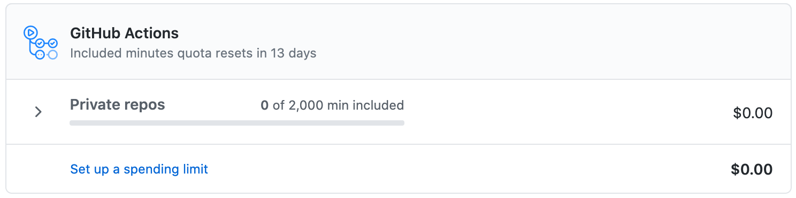
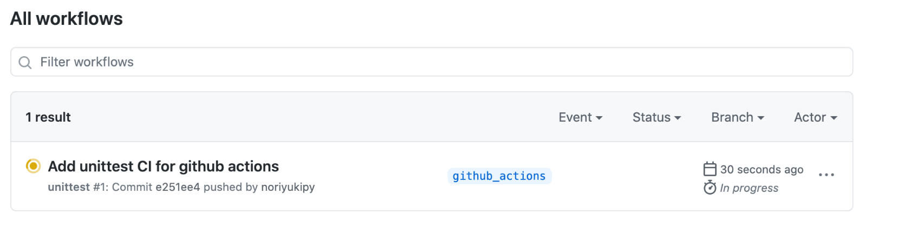
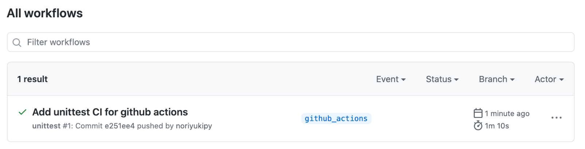

# CircleCIからGitHub Actionsへの移行
Pythonで作成しているシンプルなチャットボットフレームワーク[msgFlow](https://github.com/noriyukipy/msgflow) のCIを、以前まで利用していたCircleCIからGitHub Actionsに移行しようと思い調べた内容をまとめます。

## CircleCIで行っていた内容

CircleCIでは`.circleci/config.yml`というファイルにCIで実行する内容を記述します。この中で`python:3.8.2-buster`のコンテナ内で次のようにユニットテストを実行していました。

    $ cat .circleci/config.yml
    version: 2
    jobs:
      test-small:
        docker:
          - image: python:3.8.2-buster
        steps:
          - checkout
          - run:
              name: "Install package"
              command: |
                pip install .
                pip install pytest==5.4.3
          - run:
              name: "Run small size tests"
              command: |
                pytest -v tests/small
          - run:
              name: "Run CLI tests"
              command: |
                mkdir work
                cd work
                python -m msgflow.main init
                echo Hello | python -m msgflow.main run --config_file=config.yml
                cd ..
    

## GitHub Actionsでの設定

[GitHub Actions入門](https://docs.github.com/ja/free-pro-team@latest/actions/learn-github-actions/introduction-to-github-actions)に従って、CircleCIの内容に対応した設定をしてみます。
GitHub Actionsでは`.github/workflows` 以下にYAMLファイルをおくことで処理を記述します。

    $ mkdir -p .github/workflows
    $ touch .github/workflows/unittest.yml

このYAMLファイル（に記述した内容）をGitHub Actionsでは**ワークフロー**と呼びます。

`unittest.yml` の中にチュートリアル中のコードをひとまずコピーしてみます。

    name: learn-github-actions
    on: [push]
    jobs:
      check-bats-version:
        runs-on: ubuntu-latest
        steps:
          - uses: actions/checkout@v2
          - uses: actions/setup-node@v1
          - run: npm install -g bats
          - run: bats -v

まずは `runs-on` でCIの処理を実行する仮想環境を指定します。[サポートされているランナーとハードウェアリソース](https://docs.github.com/ja/free-pro-team@latest/actions/reference/specifications-for-github-hosted-runners#%E3%82%B5%E3%83%9D%E3%83%BC%E3%83%88%E3%81%95%E3%82%8C%E3%81%A6%E3%81%84%E3%82%8B%E3%83%A9%E3%83%B3%E3%83%8A%E3%83%BC%E3%81%A8%E3%83%8F%E3%83%BC%E3%83%89%E3%82%A6%E3%82%A7%E3%82%A2%E3%83%AA%E3%82%BD%E3%83%BC%E3%82%B9) に書かれていますので、それに従って自分に適切なものを選択します。
今回はLinux環境を使うこととし、

        runs-on: ubuntu-18.04

と指定します。

CircleCIでは、`python:3.8.2-buster` のコンテナ上でユニットテストを実行していました。GitHub Actionsでも[ドキュメント](https://docs.github.com/ja/free-pro-team@latest/actions/reference/specifications-for-github-hosted-runners#github%E3%83%9B%E3%82%B9%E3%83%88%E3%83%A9%E3%83%B3%E3%83%8A%E3%83%BC%E3%81%AB%E3%81%A4%E3%81%84%E3%81%A6)に書かれている通り同様のことができます。

> GitHubホストランナーを使用すると、マシンのメンテナンスとアップグレードが自動的に行われます。 ワークフローは、仮想マシンで直接実行することも、Dockerコンテナで実行することもできます。

ここで[リファレンスのワークフロー構文のドキュメント](https://docs.github.com/ja/free-pro-team@latest/actions/reference/workflow-syntax-for-github-actions#jobsjob_idcontainer)を読んでみると[container](https://docs.github.com/ja/free-pro-team@latest/actions/reference/workflow-syntax-for-github-actions#jobsjob_idcontainer)によりワークフローを実行するDockerコンテナを指定できるようですので、使ってみましょう。

        runs-on: ubuntu-18.04
        container:
          image: python:3.8.2-buster

この設定により、各ステップはコンテナ内で実行されます。

CircleCIでの`checkout`は`uses: actions/checkout@v2`というステップに対応しています。GitHub Actionsでは再利用可能なコードの単位としてアクションを定義しており、[`use`](https://docs.github.com/ja/free-pro-team@latest/actions/reference/workflow-syntax-for-github-actions#jobsjob_idstepsuses)を使ってステップでアクションを実行します。

あとは[`run`](https://docs.github.com/ja/free-pro-team@latest/actions/reference/workflow-syntax-for-github-actions#jobsjob_idstepsrun)でCircleCIで実行しているコマンドラインプログラムをステップとして書けば完了です。全体としては次のようになりました。

    name: unittest
    on: [push]
    jobs:
      test-small:
        runs-on: ubuntu-18.04
        container:
          image: python:3.8.2-buster
        steps:
          - name: Checkout source code
            uses: actions/checkout@v2
          - name: Install dependencies
            run: |
              pip install .
              pip install pytest~=5.0
          - name: Run small size tests
            run: |
              pytest -v tests/small
          - name: Run CLI tests
            run: |
              mkdir work
              cd work
              python -m msgflow.main init
              echo Hello | python -m msgflow.main run --config_file=config.yml
              cd ..

各ステップに`name`で名前をつけておくと、実行しているステップの内容がわかりやすく表示されるのでおすすめです。

## ローカルで実行結果の確認

この内容でCI実行してみたいと思いますが、実際にうまく動くかまだわかりません。それにも関わらずリポジトリにプッシュして実行結果を確かめるのは気が引けます。
CircleCIではローカルで実行して結果を確かめるために`circleci`コマンドを提供していました。GitHub Actionsでは[act](https://github.com/nektos/act)がそれにあたります。

actをインストールしてみましょう。MacOSではHomebrewでインストールできます。

    $ brew install act

actでは、引数としてイベントを指定します。今回はプッシュイベントでトリガーされるワークフローを作成したので、`push`引数をつけて実行します。

    $ act push
    [unittest/test-small] 🚀  Start image=python:3.8.2-buster
    [unittest/test-small]   🐳  docker run image=python:3.8.2-buster entrypoint=["/usr/bin/tail" "-f" "/dev/null"] cmd=[]
    [unittest/test-small] ⭐  Run Checkout source code
    [unittest/test-small]   ✅  Success - Checkout source code
    [unittest/test-small] ⭐  Run Install dependencies
    [unittest/test-small]   ✅  Success - Install dependencies
    [unittest/test-small] ⭐  Run Run small size tests
    | ============================= test session starts ==============================
    | platform linux -- Python 3.8.2, pytest-5.4.3, py-1.10.0, pluggy-0.13.1 -- /usr/local/bin/python
    | cachedir: .pytest_cache
    | rootdir: /github/workspace
    collected 3 items
    |
    | tests/small/main_test.py::test_load_yaml PASSED                          [ 33%]
    | tests/small/main_test.py::test_load_yaml_parse_with_env_var PASSED       [ 66%]
    | tests/small/main_test.py::test_load_yaml_parse_with_env_var_but_not_defined PASSED [100%]
    |
    | ============================== 3 passed in 0.07s ===============================
    [unittest/test-small]   ✅  Success - Run small size tests
    [unittest/test-small] ⭐  Run Run CLI tests
    | INFO:/usr/local/lib/python3.8/site-packages/msgflow/main.py:"post_service" is not defined in config file. "service" is used for "post_service" instead.
    | you> bot> Hello
    | Log: "Hello"
    [unittest/test-small]   ✅  Success - Run CLI tests

うまく動きました！

## GitHubへプッシュして動作確認

ローカルで動作確認できたので、次に実際にGitHubにプッシュしてGitHub Actionsで実行してみたいと思います。

その前に、GitHub Actionsでの料金体系について確認しておきます。[About billing for GitHub Actions](https://docs.github.com/en/free-pro-team@latest/github/setting-up-and-managing-billing-and-payments-on-github/about-billing-for-github-actions)に書かれている通り、無料のFreeプランではプライベートリポジトリに対して毎月2,000時間までは無料でGitHub Actionsを実行できます。
ここで気になるのは2,000時間を超えたらどうなるかということですが、[ドキュメント](https://docs.github.com/en/free-pro-team@latest/github/setting-up-and-managing-billing-and-payments-on-github/about-billing-for-github-actions#about-spending-limits)によると毎月の支払い形態をとっている場合はデフォルトで超過できないように spending limit が $0 に設定されているとのこと。実際にGitHub右上のユーザアイコンから[settings]→[Billing&plans]からみると次のようにspending limitが$0に設定されているのがわかり、時間超過した場合には請求されることなくGitHub Actionsの利用が停止されることがわかります。

今回はパブリックリポジトリですので料金に関しては気にしなくて問題ありませんが、プライベートリポジトリでも気づかずに料金超過する心配は無いことがわかりました。

さて、リモートリポジトリにプッシュしてGitHub Actionsが実行されるかみてみましょう。

    $ git co -b github_actions
    $ git cm -m "Add unittest CI for github actions"
    $ git push origin github_actions

GitHubのリポジトリページの[Actions]タブに移動すると次のようにワークフローが実行されていることがわかります。

しばらく待つとワークフローが正常に終了したことがわかります。

実行完了した項目をクリックすると実行内容の詳細を表示できます。

## まとめ

今回はCircleCIでコンテナ上で実行していたユニットテストの処理をGitHub Actionsのワークフローで実行する方法について調べました。
実行に関しては、CircleCIの`circleci`コマンドに対応する`act`コマンドでローカル実行したのち、GitHub上で実行が成功することを確認しました。

GitHub上でCIまで完結するため非常に便利な印象をもちました。

